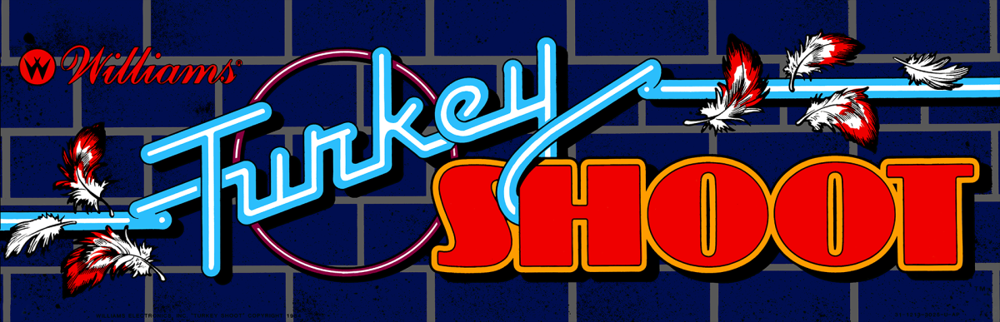

# [Turkey Shoot - The Day They Took Over](https://www.arcade-museum.com/game_detail.php?game_id=10222) for [MiSTer](https://mister-devel.github.io/MkDocs_MiSTer/)



Original core developed by [darfpga](https://github.com/darfpga) - [Original Source](https://github.com/darfpga/vhdl_turkey_shoot)

Ported to MiSTer by [birdybro](https://github.com/birdybro)

## Description

This is a simulation model of the Turkey Shoot hardware released in 1984. Approximately only 450 units were produced. It is labeled "Prototype" by MAME, but plays quite well and it doesn't seem like a Prototype to me. 

The original hardware had two panes of glass and in-between there was a vent and an inlet. In this place in-between the two panes of glass there were feathers inside and a fan would blow the feathers around whenever you shot a turkey.

The game was designed by [John R. Newcomer](https://en.wikipedia.org/wiki/John_Newcomer). Software was programmed by Thomas N. Dreaux and Wayne P. Breivogel. Graphics were done by Chris L. Simmons and Jill Chittenden (Mystic Marathon).

## Controls

| Name     | Description                            |
| -------- | -------------------------------------- |
| Fire     | Shoot your gun                         |
| Grenade  | Fire a grenade (AoE)                   |
| Gobble   | Gobble at the turkeys to distract them |
| Left     | Move gun left                          |
| Right    | Move gun right                         |
| Up       | Move gun up                            |
| Down     | Move gun down                          |
| Coin     | Put in a coin                          |
| Start    | Start the game with 1 Player           |

## Service Menu

When you press the "Advance" button in the OSD, this enables you to access the bookkeeping totals by then pressing "Auto Up" in the OSD. Currently the data in here is not saved to the MiSTer but that may come at a later time. 

If you want to change any options, then press "Auto Up" again to see the Game Adjustments menu. Here you use up and and down to move to whatever option you want to change and then use the right and left inputs to modify the desired setting. You then push "Auto up" again to set the changes.

If you press "Advance" again, it will return to it's original state (not in service mode), but "Auto Up" now will cycle through various test programs that the arcade board used to have.

High Score reset is another internal button, and it makes the game pause for a second until the high score resets.

One of the coolest features of the Williams service menu was you could customize the attract mode screen with your own letters!

## To-Do

* No hiscore or pause modules yet, I have to learn how to implement them first.
* The flickering at the bottom of the screen and the centering being a little weird seems to be part of how the original hardware worked (similar to cram dots on Genesis), they were likely in the overscan area. I might add some cropping to that later as an OSD option.

## ROM Files Instructions

ROMs are not included! In order to use this arcade core, you will need to provide the correct ROM file yourself.

To simplify the process .mra files are provided in the releases folder, that specify the required ROMs with their checksums. The ROMs .zip filename refers to the corresponding file from the MAME project.

Please refer to [https://github.com/MiSTer-devel/Main_MiSTer/wiki/Arcade-Roms-and-MRA-files](https://github.com/MiSTer-devel/Main_MiSTer/wiki/Arcade-Roms-and-MRA-files) for information on how to setup and use the environment.

Quick reference for folders and file placement:

```
/_Arcade/<game name>.mra  
/_Arcade/cores/<game rbf>.rbf  
/_Arcade/mame/<mame rom>.zip  
/_Arcade/hbmame/<hbmame rom>.zip  
```
